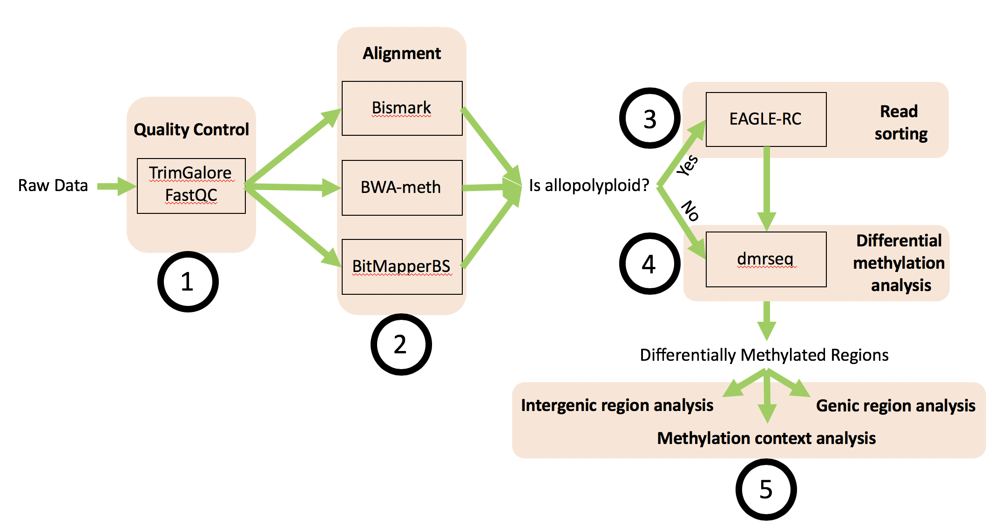

[](https://travis-ci.com/supermaxiste/ARPEGGIO) \


## ARPEGgIO: Automated Reproducible Polyploid EpiGenomic Workflow


ARPEGGIO is a snakemake workflow that analyzes whole genome bisulfite sequencing (WGBS) data coming from (allo)polyploid species. The workflow includes all basic steps in WGBS data analysis with two additional features specific for allopolyploids:

 - EAGLE-RC: a read-sorting algorithm developed by  to accurately assign reads coming from allopolyploids
 - Three downstream analyses for Differentially Methylated Regions (DMRs): 1) methylation contexts' overlap, 2) intergenic DMRs analyses and 3) genic DMRs analyses.

 

## Motivation

Whole genome sequencing is becoming cheaper every year and it's now much easier for plant scientists to generate high-throughput data for plants. Compared to other organisms plants show very large genomes and for flowering plants specifically, polyploidy (especially allopolyploidy) is common. Both genome complexity and polyploidy make it difficult to analyze genetic and epigenetic data. For genetic data a lot has been done for many other organisms and most of the tools can be used for plants as well. For epigenetic data, more specifically WGBS, less has been done and no standard exists.
This workflow tries to overcome this gap by providing an automated and reproducible way to analyze WGBS data coming from allopolyploids with different tools.

## Why ARPEGgIO?

ARPEGgIO is based on Snakemake, a tool for reproducible and scalable data analyses. Snakemake tries to offer the best trade-off between expert and less-experienced users. At its heart, Snakemake aims at being easily interpretable and adaptable to create workflows that are simple to re-run with new data. ARPEGgIO follows this philosophy and provides a workflow that is easy to adapt for all WGBS coming from allopolyploids.

## Installation

To install this workflow you first need to [install Snakemake via Conda](https://snakemake.readthedocs.io/en/stable/getting_started/installation.html). Once everything is set up, run the following commands to clone the ARPEGGIO repository to your computer and create a conda environment with all the tools needed to run the analyses in the workflow.

```
conda install conda-build
conda build eagle
conda env create --name ARPEGGIO -f envs/environment.yaml
conda install -n snakemake --use-local eagle
conda activate ARPEGGIO
snakemake
```
## Setup and run

Check out the Wiki to set up and run ARPEGgIO. The Wiki includes also a map of the output with explanations about the content of each folder. 

## Troubleshooting and support

Google doesn't help? Are you stuck on an error that no one else seems to be having? Have you checked all the pages mentioning your problem but the solutions are not suitable? On the Wiki there's a list of common problems together with some general solutions. If that didn't work either, feel free to open an issue. Please make sure to describe your problem/errors and your trials in detail so that you can get the best help possible.

## Credits

This project was inspired by , if you work with RNA-seq data check it out!
