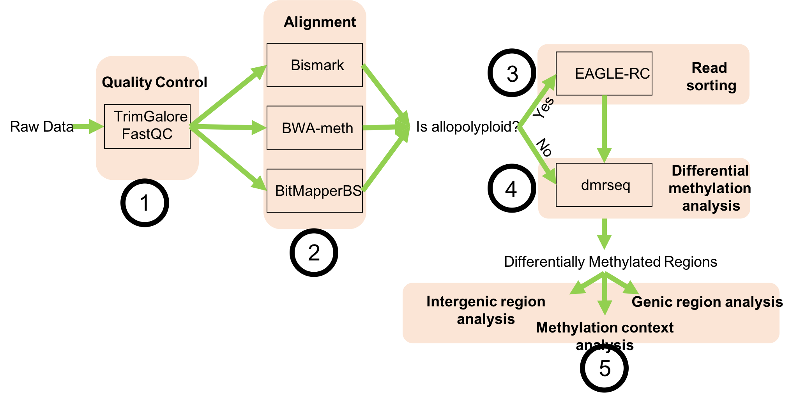

 \

## ARPEGgIO: Automated Reproducible Polyploid EpiGenomic Workflow

ARPEGGIO is a snakemake workflow that analyzes whole genome bisulfite sequencing (WGBS) data coming from (allo)polyploid species. The workflow includes all basic steps in WGBS data analysis with two additional features specific for allopolyploids:

 - EAGLE-RC: a read-sorting algorithm developed by Tony Kuo to accurately assign reads coming from allopolyploids
 - Three downstream analyses for Differentially Methylated Regions (DMRs): 1) methylation contexts, 2) intergenic DMRs and 3) genic dmrseq
 

 ## Motivation

Whole genome sequencing is becoming more and more affordable and plant scientists are struggling less and less in generating high-throughput data for plants. Compared to other organisms plants show very large genomes and for flowering plants specifically, polyploidy (especially allopolyploidy) is common. Both these aspects make it difficult to analyze both genetic and epigenetic data. For genetic data a lot has been done for many other organisms and most of the tools can be used for plants as well. For epigenetic data, more specifically WGBS, less has been done and no standard exists.
This workflow tries to overcome this gap by providing an automated and reproducible way to analyze WGBS data coming from allopolyploids with different tools.
