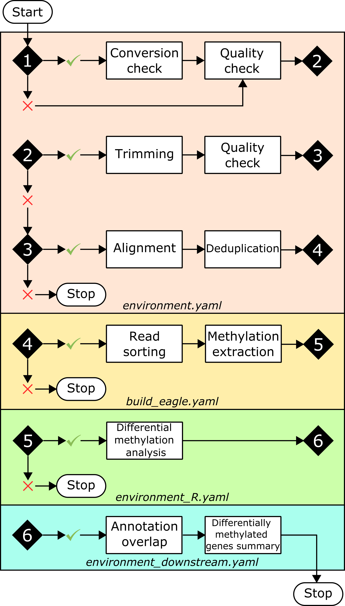

[](https://travis-ci.com/supermaxiste/ARPEGGIO) \


## ARPEGGIO: Automated Reproducible Polyploid EpiGenetic GuIdance wOrkflow


ARPEGGIO is a snakemake workflow that analyzes whole genome bisulfite sequencing (WGBS) data coming from (allo)polyploid species. The workflow includes all basic steps in WGBS data analysis (trimming, quality check and alignment), a read sorting tool specific for allopolyploids, the most comprehensive statistical tool for Differential Methylation (DM) analysis and a set of downstream analyses to obtain a list of genes showing differential methylation.

## Motivation

In the last decade, the use of High-Throughput Sequencing (HTS) technologies has become widespread across life sciences. With technology not being a bottleneck anymore, the new challenge with HTS data has shifted towards data analysis.
To process and analyze WGBS data, many tools exist, but most of them were developed and/or tested with a focus on diploid model species. For polyploid species there are some complexities that are often not taken into account. One example is the large amount of duplicated genes in polyploids (homeologous genes) which might be challenging at the mapping step and influence downstream analyses.
To help with the analysis of polyploid WGBS data we developed ARPEGGIO: an automated and reproducible workflow which aims at being easy to set up and use.

## Why ARPEGGIO?

ARPEGGIO is easily setup with one configuration file and once ready, it will automatically analyse your WGBS data to provide a list of differentially methylated regions (DMRs). Thanks to Snakemake, a human readable, Python based language for workflows and Conda, a widely-used package manager, ARPEGGIO takes care of installing all the software needed fo the analyses and running all the steps in the workflow in the correct order. ARPEGGIO also ensures reproducibility of your analysis, you only need to share your configuration and your initial raw data.

## What's new in ARPEGGIO?

Besides the workflow itself (which is already quite a lot of new), ARPEGGIO includes an allopolyploid specific read-sorting algorithm that has been adapted to deal with BS-seq data: [EAGLE-RC](https://github.com/tony-kuo/eagle). Check out the papers ["Homeolog expression quantification methods for allopolyploids"](https://doi.org/10.1093/bib/bby121) and ["EAGLE: Explicit Alternative Genome Likelihood Evaluator"](https://doi.org/10.1186/s12920-018-0342-1) by Kuo _et al._ for more details. Together with EAGLE-RC, there's also `dmrseq`: an R package for differential methylation analysis. This package has one of the most comprehensive approaches to deal with WGBS data problems: mainly statistical and computational. If you're curious check out ["Detection and accurate false discovery rate control of differentially methylated regions from whole genome bisulfite sequencing"](https://doi.org/10.1093/biostatistics/kxy007) by Korthauer _et al_.

## Workflow overview



## Installation

To install this workflow you first need to [install Snakemake via Conda](https://snakemake.readthedocs.io/en/stable/getting_started/installation.html). To further ensure reproducibility you can also install [Singularity](http://singularity.lbl.gov/). Once everything is set up, run the following commands to clone the ARPEGGIO repository to your computer and run the workflow. With Conda only:

```
git clone https://github.com/supermaxiste/ARPEGGIO
cd ARPEGGIO
snakemake --use-conda
```

With Conda and Singularity:

```
git clone https://github.com/supermaxiste/ARPEGGIO
cd ARPEGGIO
snakemake --use-conda --use-singularity
```

## Setup and run

Check out the [Wiki](https://github.com/supermaxiste/ARPEGGIO/wiki) to set up and run ARPEGGIO. If you're in a hurry you can also find a Quick Setup section. The Wiki will help you better understand the workflow design, input, output and summary files.

## Troubleshooting and support

Google doesn't help? Are you stuck on an error that no one else seems to be having? Have you checked all the pages mentioning your problem but the solutions are not suitable? On the Wiki there's a list of common problems together with some general solutions. If that didn't work either, feel free to open an issue. Please make sure to describe your problem/errors and your trials in detail so that you can get the best help possible.

## Credits

This project was inspired by , if you work with RNA-seq data check it out!
